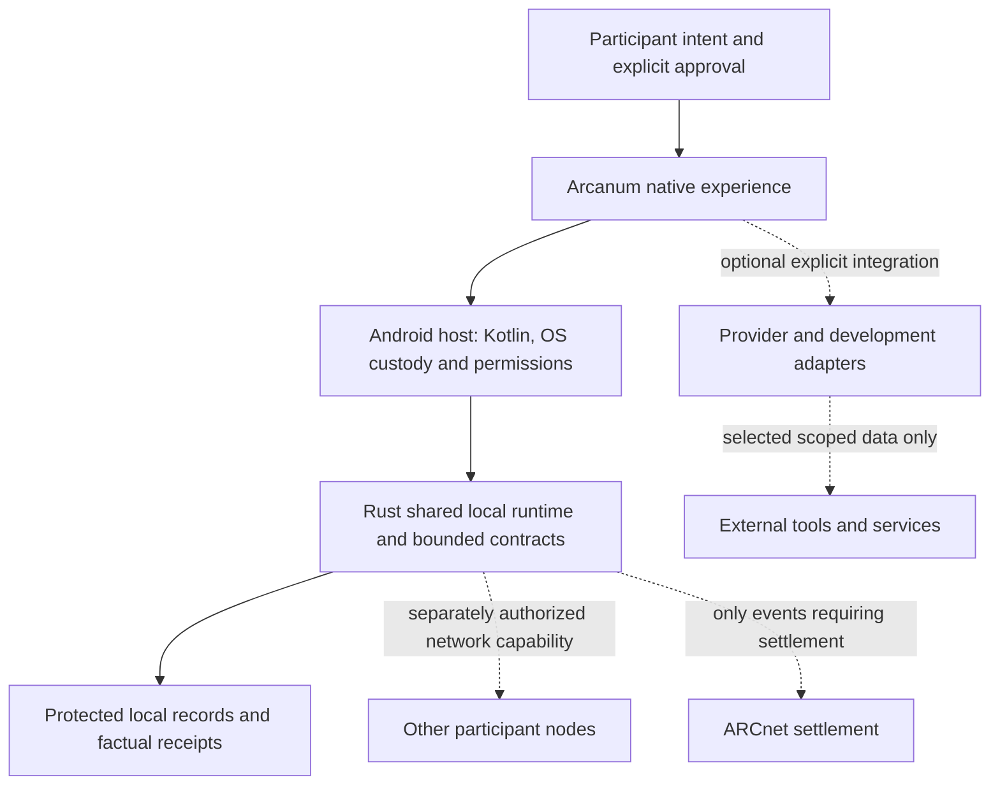

# Authority and implementation map

This map connects existing sources. It creates no constitution, permission, economic
parameter or new prerequisite for A19. Read each linked source within its own scope.
The October 7 Human clarification is that the phone is the intended home: ordinary
participants should not need Termux, Notion, Drive or a separate developer setup.
Existing tools assist construction; optional integrations may extend the node.
This direction is not a claim that every function is already self-contained.

## Start with the right question

| Question | Starting point | What it establishes |
| --- | --- | --- |
| What may the system do? | [Layer boundaries](../doctrine/layer-boundaries.md), [module canon](canonical-modules.md), [App/Chain/Doctrine contract](app-chain-doctrine.md) | Constitutional constraints; implementation cannot amend them. |
| What rules govern economic value? | [Economic Constitution](../economics/economic-constitution.md) | Controlling economic authority; numerical policy and activation remain separately bounded. |
| Who can decide and execute? | [Governance specification](../governance/governance-specification.md), [Treasury Constitution](../governance/treasury-constitution.md) | Delegated decision and execution rules, subordinate to higher doctrine. |
| What has actually been built? | [Derived current state](../governance/architectgpt/current-state.md), [arc ledger](../roadmap/construction-era-arc-ledger.md) | Dated implementation evidence; an arc closure is not wave closure. |
| What can this environment do now? | [Operational capabilities](../governance/architectgpt/operational-capabilities.md) | Dated observed access and test limits; recheck liveness before use. |
| How is the node intended to fit together? | [Native decisions](arcnet-native-decisions.md), [Construction baseline through CE-W03](../repo/arcanum-baseline.md) | Accepted technical direction and its dated foundational evidence. |

For economic conflicts the existing order is Doctrine → Economic Constitution →
specialized constitutions within their domains → Governance Specification → policy
summaries/delegated parameters → implementation. This order comes from the Economic
Constitution; this map does not replace its qualifications or amendment procedure.

## The phone as home

The following is a technical ownership view, not a replacement for doctrine's formal
layers or a claim that all boxes are implemented.

Rust owns shared device-side contracts; the host supplies platform security and
presentation. Android Keystore custody currently stays host-side rather than moving
keys into a generic runtime. The phone is not automatically a consensus validator.
Private reflection, factual local receipts, peer synchronization and chain finality
are separate concerns. Local ownership does not imply that all network, governance
or economic truth can be decided by one device.

| Function | Current evidence | Remaining portability work |
| --- | --- | --- |
| Private Hope capture and surviving-record recall | Native Rust contract and Android protected storage; CE-W03 and later closure evidence | A19 collection/migration/deletion/corruption contract remains next. No connector is needed for basic capture/recall. |
| Architect evidence and conversation | A17 local custody; A18 bounded native conversation via a home-computer model gateway | On-phone inference or another qualified profile, packaging, resources, cancellation and recovery require their own work. A18 success is not phone-only inference. |
| Development and verification | Human-operated fixed-command Termux broker plus external repository/CI tools | Guided native proposal, preview, verification and package workflows remain incomplete. Shell access must not become the implicit participant interface. |
| Provider integration | GitHub/Notion/Drive support present development; explicit model gateway profile | Optional adapters need declared capability, selected-data preview, revocation and failure behavior. Tool availability alone is not interoperability qualification. |
| Shared recovery and settlement | Architectural direction and separate prototypes | Peer recovery, consensus, governance activation, economic mechanisms and resource compensation are not established by local persistence. |

The intended newcomer path is describe → inspect a proposed change → preview → test
→ deliberately authorize the applicable effect. It should not require knowledge of
Git, shells or today's AI tools. This is a product direction recorded from the Human;
it is not an already implemented autonomous builder or a grant to publish changes.

## Keep the distinctions visible

- The Human Architect's current repository/release authority is not permanent
  unilateral control of a future common Treasury or protocol.
- Vitae recognition, eligibility for a responsibility, appointment, approval and
  execution are distinct. Do not turn recognition permanence into permanent access.
- “Canonical” describes document authority within scope, not implementation maturity.
  `canonical-draft` governance pages do not prove activated councils or voting.
- A local preview counter, a chain query, transaction submission and final settlement
  need distinct records. A purpose such as reward or fee cannot hide its monetary
  operation or funding source.
- Notion, Drive and the site can present context; their location cannot grant authority
  or become mandatory custody for private participant state.

## Audit boundaries and next decisions

The [participant journey proposal](participant-journey-proposal.md) reconciles the
Vitae drafts and web scaffolding with open creation, consenting group trials and
reviewed architect responsibility. The [validation plan](simulation-and-chronology-plan.md)
connects economic and topology simulation to a factual chronology and optional
community narrative. Both remain proposals.

Read the [October 7 audit](../evidence/pre-a19-architecture-audit-20261007/review.md)
for concrete defects, bounded fixes and unresolved design. Governance formulas,
appeals, economic routing and self-contained development packaging must be designed
and tested in their own scopes. None is silently added to A19's acceptance criteria.
